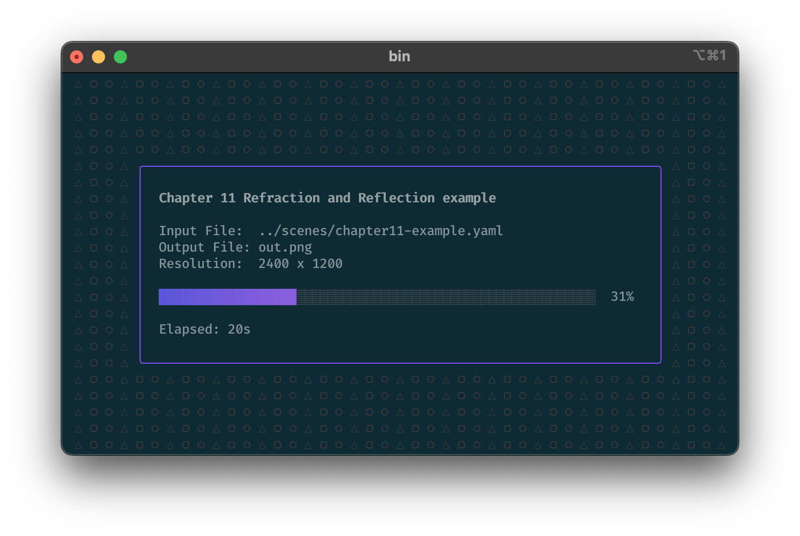
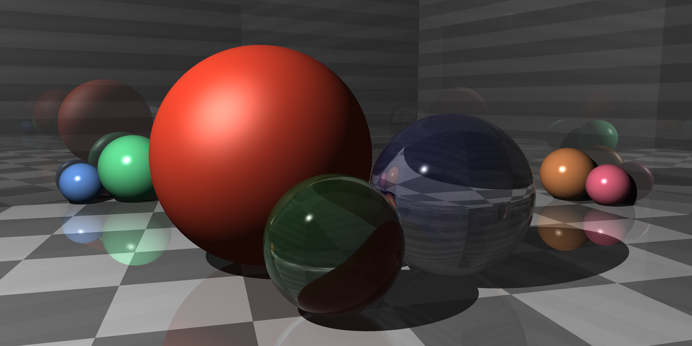

# jtracer

This project is my Golang implementation of a [ray tracer](https://en.wikipedia.org/wiki/Ray_tracing_(graphics)) implemented by following Jamis Buck's excellent book [The Ray Tracer Challenge](http://raytracerchallenge.com).

There are many like it, but this one is mine.

## Usage

Test:

    make test

Build: 

    make build

Run: 

     ./jtracer  scenes/chapter11-example.yaml

## Example Renders

